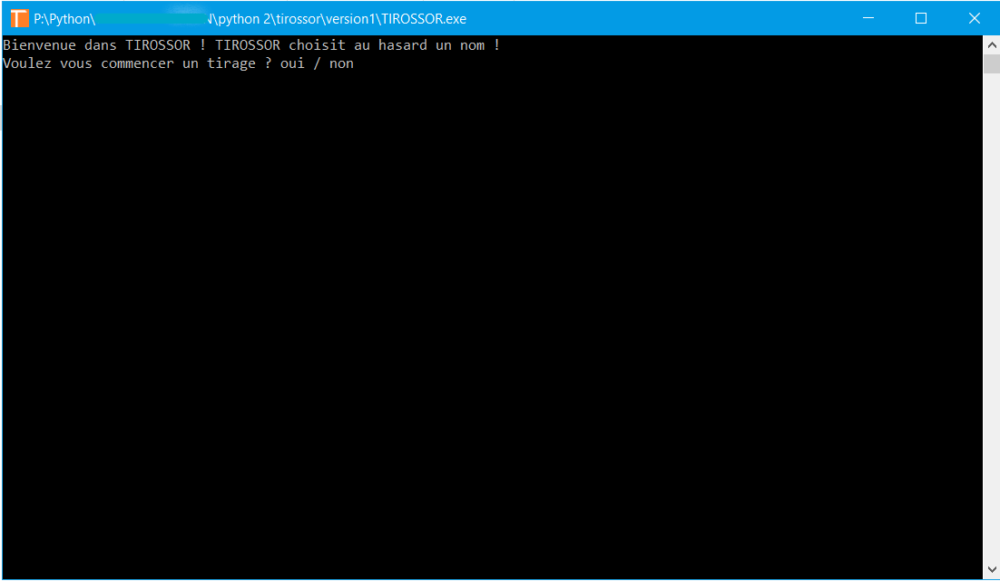
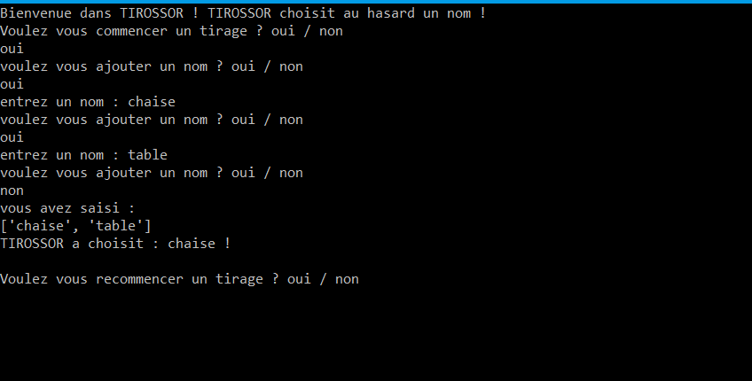

# DOCUMENTATION DE TIROSSOR
## 1. Qu'est-ce que Tirossor ?
Tirossor est un logiciel développé en Python, dans sa version 2.7. Son but est simple : il permet de choisir aléatoirement un terme parmi un liste de mots rentrée par l'utilisateur.

## 2. Comment installer Tirossor ?
Vous disposer de deux façons pour installer Tirossor. 
1. **Via Github** : Si vous êtes habitué à Github et à Git, vous pouvez cloner le projet via la commande `git clone https://github.com/antton-dev/tirossor1.git`
2. **Télécharger l'archive zip** : Si vous préférez une méthode plus visuelle, vous pouvez télécharger directement l'archive zip du projet. Pour cela, cliquez le bouton vert "clone or download" en haut à droite du projet, puis sur "download ZIP". L'archive zip sera alors téléchargée sur votre ordinateur. Vous n'avez plus qu'à la décompresser.

Pour exécuter Tirossor, ouvrez le fichier TIROSSOR.exe.

**Note importante**
Quelque soit votre méthode de téléchargement, veillez à ne pas modifier l'architecture des fichiers et dossiers et de ne pas supprimer de fichiers.

## 3. Comment utiliser Tirossor ?
Commencez par ouvrir le fichier TIROSSOR.exe. Laissez éventuellement votre antivirus faire l'analyse. Tirossor ne contient aucun virus.
Une fois l'analyse rapide terminée, une fenêtre de console s'ouvre (cf. point 6). Suivez les instructions présentées par le programme.

## 4. Puis-je participer à Tirossor ?
Oui ! Bien sûr ! Toute aide est la bienvenue. Si vous constatez une erreur ou remarquez une amélioration à apporter, n'hésitez pas à faire une modification et faire un pull request. Si vous n'êtes pas habitué à Git et Github, ou si vous ne savez pas programmer en python, contactez-moi (cf. point 5).

## 5. Comment contacter l'auteur ?
- Auteur : Anttondev
- email : antton.chevrier@gmail.com

## 6. Captures

