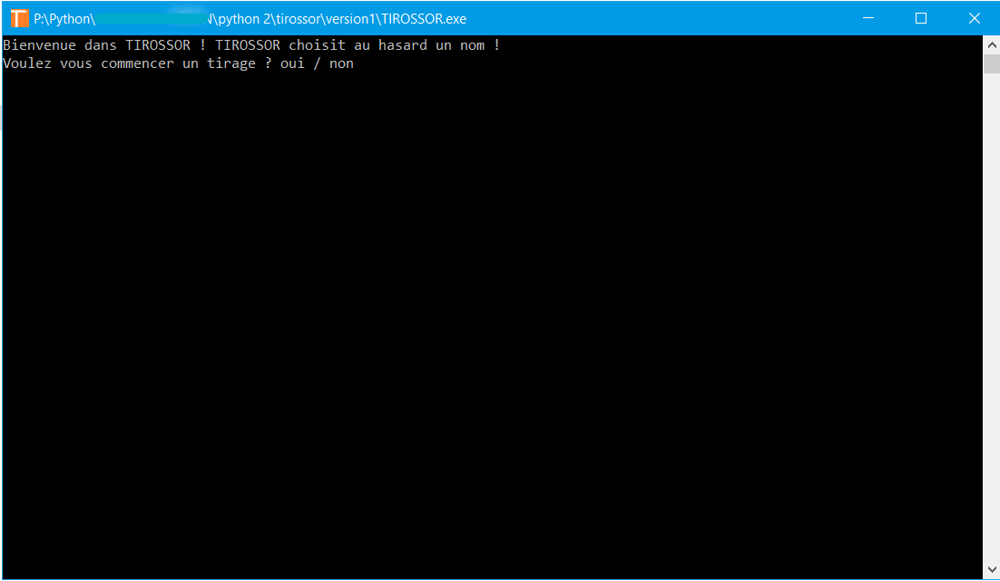
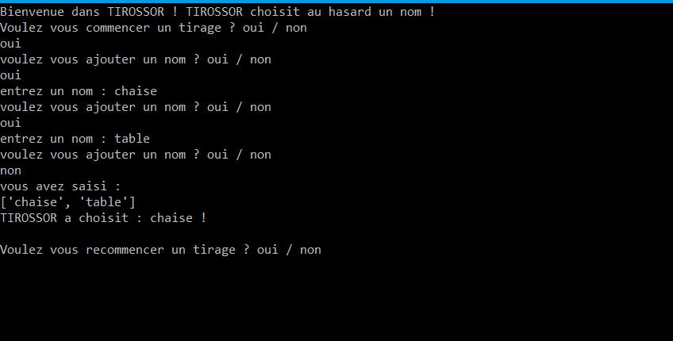

# DOCUMENTATION DE TIROSSOR

## 1. Qu'est-ce que Tirossor ?

Tirossor est un logiciel développé en Python, dans sa version 2.7. Son but est simple : il permet de choisir aléatoirement un terme parmi un liste de mots rentrée par l'utilisateur.

  

## 2. Comment installer Tirossor ?

Vous disposer de deux façons pour installer Tirossor.

1.  **Via Github** : Si vous êtes habitué à Github et à Git, vous pouvez cloner le projet via la commande `git clone https://github.com/antton-dev/tirossor1.git`

2.  **Télécharger l'archive zip** : Si vous préférez une méthode plus visuelle, vous pouvez télécharger directement l'archive zip du projet. Pour cela, cliquez le bouton vert "clone or download" en haut à droite du projet, puis sur "download ZIP". L'archive zip sera alors téléchargée sur votre ordinateur. Vous n'avez plus qu'à la décompresser.

  

Pour exécuter Tirossor, ouvrez le fichier TIROSSOR.exe.

  

**Note importante**

Quelque soit votre méthode de téléchargement, veillez à ne pas modifier l'architecture des fichiers et dossiers et de ne pas supprimer de fichiers.

  

## 3. Comment utiliser Tirossor ?

Commencez par ouvrir le fichier TIROSSOR.exe. Laissez éventuellement votre antivirus faire l'analyse. Tirossor ne contient aucun virus.

Une fois l'analyse rapide terminée, une fenêtre de console s'ouvre (cf. point 7). Suivez les instructions présentées par le programme.

  

## 4. Puis-je participer à Tirossor ?

Oui ! Bien sûr ! Toute aide est la bienvenue. Si vous constatez une erreur ou remarquez une amélioration à apporter, n'hésitez pas à faire une modification et faire un pull request. Si vous n'êtes pas habitué à Git et Github, ou si vous ne savez pas programmer en python, contactez-moi (cf. point 5).

  

## 5. Comment contacter l'auteur ?

- Auteur : Anttondev

- email : antton.chevrier@gmail.com

## 6. Licence

Cette oeuvre est déposée sous la license MIT.

Vous avez le droit de :

- distribuer

- Modifier

- En faire une utilisation commerciale

- En faire une utilisation personnelle

-------  

A condition de :

- Indiquer le copyright et la license, disponible ci dessous.

-----------

Avec les limitations suivantes :

- Responsabilité

- Garantie

  

### 6.1 Avis de Copyright et licence

> MIT License
> 
> Copyright (c) [2020] [Anttondev]
> 
> Permission is hereby granted, free of charge, to any person obtaining
> a copy of this software and associated documentation files (the
> "Software"), to deal in the Software without restriction, including
> without limitation the rights to use, copy, modify, merge, publish,
> distribute, sublicense, and/or sell copies of the Software, and to
> permit persons to whom the Software is furnished to do so, subject to
> the following conditions:
> 
> The above copyright notice and this permission notice shall be
> included in all copies or substantial portions of the Software.
> 
> THE SOFTWARE IS PROVIDED "AS IS", WITHOUT WARRANTY OF ANY KIND, EXPRESS OR IMPLIED, INCLUDING BUT NOT LIMITED TO THE WARRANTIES OF MERCHANTABILITY, FITNESS FOR A PARTICULAR PURPOSE AND NONINFRINGEMENT. IN NO EVENT SHALL THE AUTHORS OR COPYRIGHT HOLDERS BE LIABLE FOR ANY CLAIM, DAMAGES OR OTHER LIABILITY, WHETHER IN AN ACTION OF CONTRACT, TORT OR OTHERWISE, ARISING FROM, OUT OF OR IN CONNECTION WITH THE SOFTWARE OR THE USE OR OTHER DEALINGS IN THE SOFTWARE.

## 7. Captures

